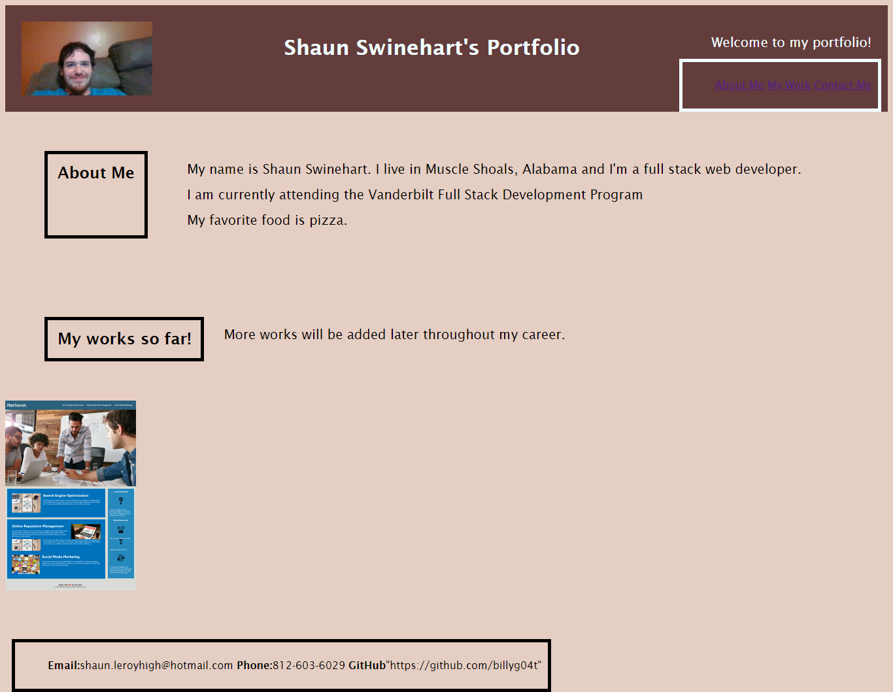

# portfolio-for-shaun
A portfolio for employers
## Description

- The goal is for the website to be more search engine optimized.
- The code now has alt attributes added to images.
- The code follows better semantic practices.
- Dev notes have been added to the source code's css file.

## Credits

Readme Template was copied from Vanderbilt Bootcamp Prework Module 3.5.3
[https://courses.bootcampspot.com/courses/3801]

CSS positioning tutorial from Web Dev Simplified

[https://www.youtube.com/watch?v=jx5jmI0UlXU]

mod-challenge-1 was used for reference on coding structure and semantics

[https://billyg04t.github.io/mod-challenge-1/]

Previous activities in bootcamp were used as references

Module 1 and Module 2

## Usage

Link to website:
[https://billyg04t.github.io/portfolio-for-shaun/]

## License

MIT License
 
Copyright (c) [2023] [Shaun Swinehart]

Permission is hereby granted, free of charge, to any person obtaining a copy
of this software and associated documentation files (the "Software"), to deal
in the Software without restriction, including without limitation the rights
to use, copy, modify, merge, publish, distribute, sublicense, and/or sell
copies of the Software, and to permit persons to whom the Software is
furnished to do so, subject to the following conditions:

The above copyright notice and this permission notice shall be included in all
copies or substantial portions of the Software.

THE SOFTWARE IS PROVIDED "AS IS", WITHOUT WARRANTY OF ANY KIND, EXPRESS OR
IMPLIED, INCLUDING BUT NOT LIMITED TO THE WARRANTIES OF MERCHANTABILITY,
FITNESS FOR A PARTICULAR PURPOSE AND NONINFRINGEMENT. IN NO EVENT SHALL THE
AUTHORS OR COPYRIGHT HOLDERS BE LIABLE FOR ANY CLAIM, DAMAGES OR OTHER
LIABILITY, WHETHER IN AN ACTION OF CONTRACT, TORT OR OTHERWISE, ARISING FROM,
OUT OF OR IN CONNECTION WITH THE SOFTWARE OR THE USE OR OTHER DEALINGS IN THE
SOFTWARE.